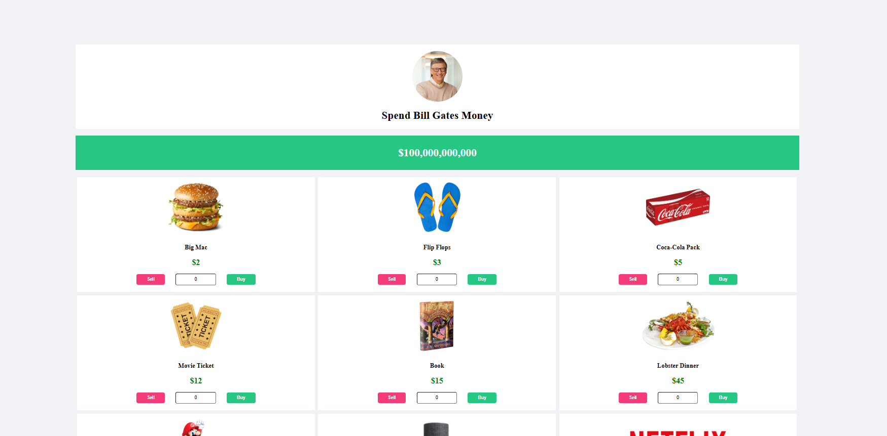

# Spend Bill Gates' Money - React Web Application

You can check out the live demo of the application here: [Demo Link](https://nejibill.netlify.app/)



## Installation

To run this project locally, follow these steps:

1. **Clone the repository:**

```bash
git clone https://github.com/onuryilmaze/billgates.git
```

3. **Move to the project file:**

```bash
cd billgates
```

2. **Install the dependencies:**

Make sure you have Node.js installed, and run:
```bash
npm install
```
3. **Start the development server:**

```bash
npm run dev
```
